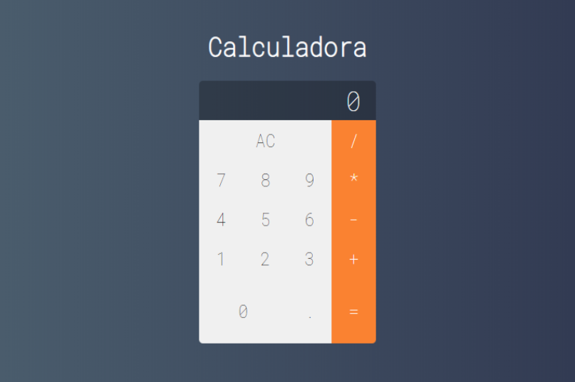

# Calculadora



Calculadora feita no  curso de React e Redux

Este código cria uma calculadora com função de:

- adição
- subtração
- divisão
- multiplicação

## Pré-requisitos

- NPM

## Instalação

```sh
npm install
```

## Executar o app

```sh
npm start
```

Para visualizar acesse http://localhost:3000 em seu navegador.

## Fazer o build do app

```sh
npm run build
```
Este comando vai gerar a versão final do seu app na pasta `build` e você pode publicar ela em um servidor.